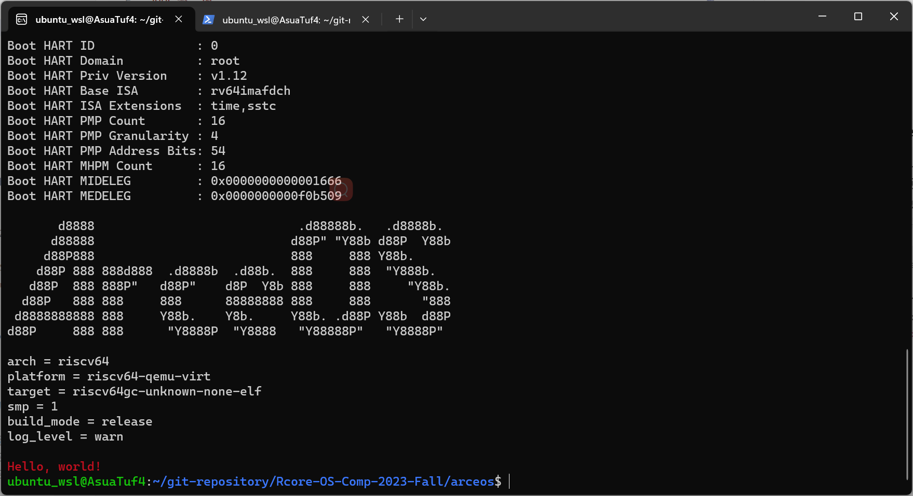
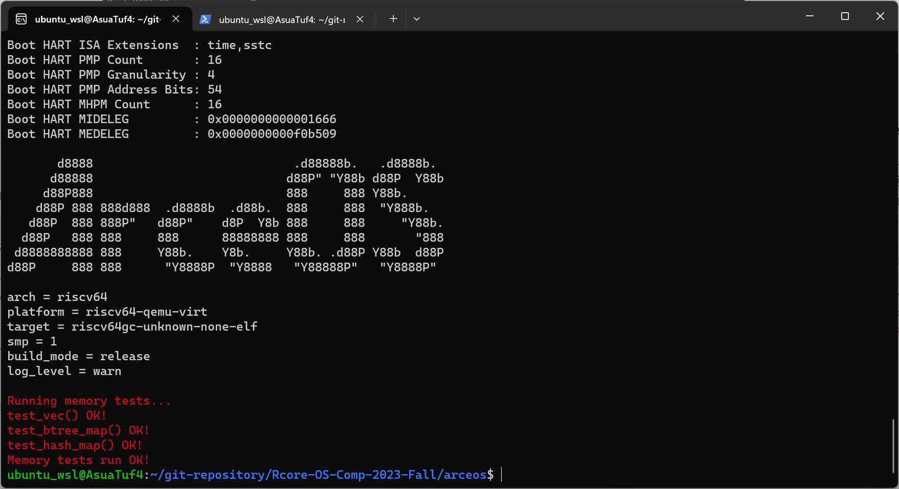

# ArceOS学习笔记

## 练习

### 第一周

#### 练习1 彩色打印hello world

一开始想修改底层的putchar，无从下手。然后尝试在println里面直接打印ANSI转义字符可以改变颜色。于是在println的实现里加了两个改变颜色和重置颜色的转义字符(\x1b[31m将后续字符变为红色，\x1b[0m重置状态)，实现println打印颜色改变：

```rust
// ulib/axstd/src/macros.rs
#[macro_export]
macro_rules! println {
    () => { $crate::print!("\n") };
    ($($arg:tt)*) => {
        $crate::io::__print_impl(format_args!("\x1b[31m{}\x1b[0m\n", format_args!($($arg)*)));
    }
}
```



#### 练习2 实现HashMap

剪切标准HashMap的代码至不到300行，主要的问题是要重写标准库HashMap中的new函数，这里使用到了给出的随机数生成代码：

```rust
// ulib/axstd/src/hash_map.rs
use spinlock::SpinNoIrq;
use axhal::time;
static PARK_MILLER_LEHMER_SEED: SpinNoIrq<u32> = SpinNoIrq::new(0);
const RAND_MAX: u64 = 2_147_483_647;

pub fn random() -> u128 {
    let mut seed = PARK_MILLER_LEHMER_SEED.lock();
    if *seed == 0 {
    *seed = time::current_ticks() as u32;
    }
    let mut ret: u128 = 0;
    for _ in 0..4 {
    *seed = ((u64::from(*seed) * 48271) % RAND_MAX) as u32;
    ret = (ret << 32) | (*seed as u128);
    }
    ret
}
......
impl RandomState {
    #[inline]
    #[allow(deprecated)]
    // rand
    #[must_use]
    pub fn new() -> RandomState {
        RandomState { k0: random() as u64, k1: random() as u64}
    }
}
```

注意需要使用arceos中的axhal模块，需要在Cargo.toml中增加依赖：

```rust
// ulib/axstd/Cargo.toml
[dependencies]
......
axhal = {path = "../../modules/axhal"}
```

最后需要将新的HashMap加入到axstd声明的collections模块中，这样HashMap和BTreeMap才能同时使用axstd::collections:HashMap和axstd::collections:BTreeMap引用:

```rust
// ulib/axstd/src/lib.rs
#[cfg(feature = "alloc")]
mod hash_map;

#[cfg(feature = "alloc")]
#[doc(no_inline)]
pub mod collections {
    extern crate alloc;
    pub use alloc::collections::*;
    pub use crate::hash_map::HashMap;
}
```

